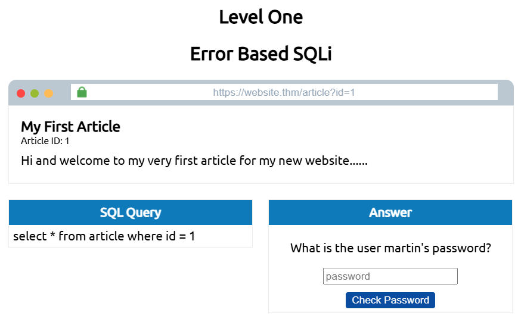
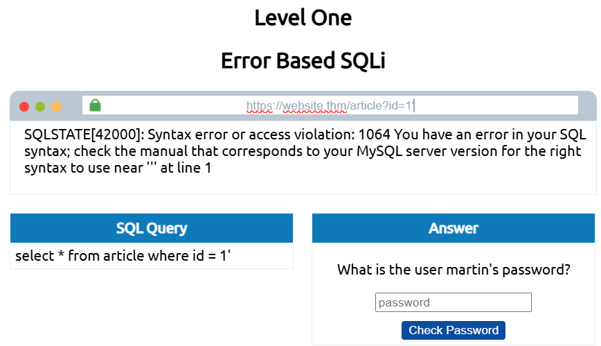
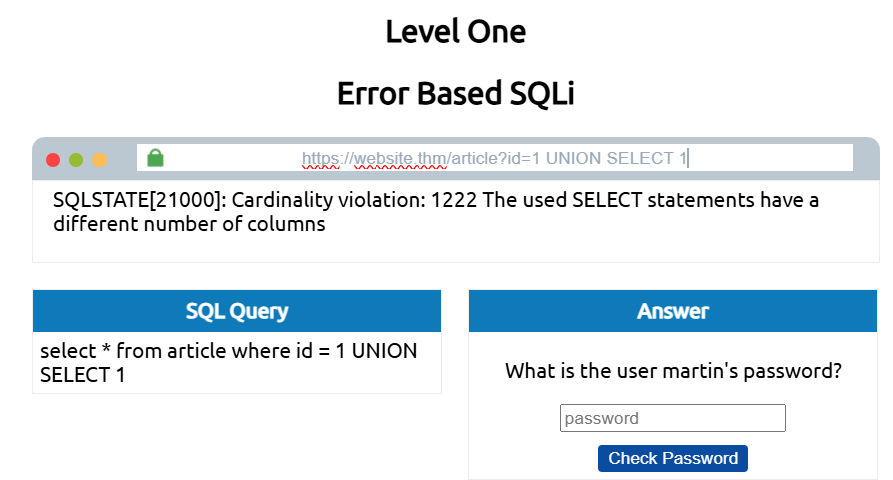
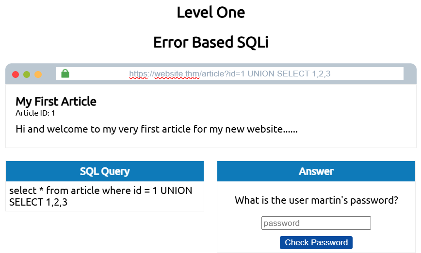
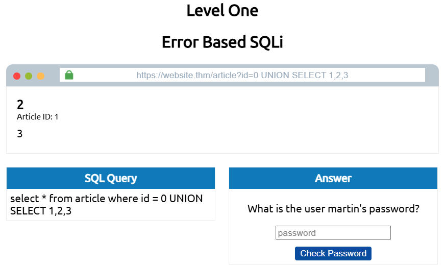
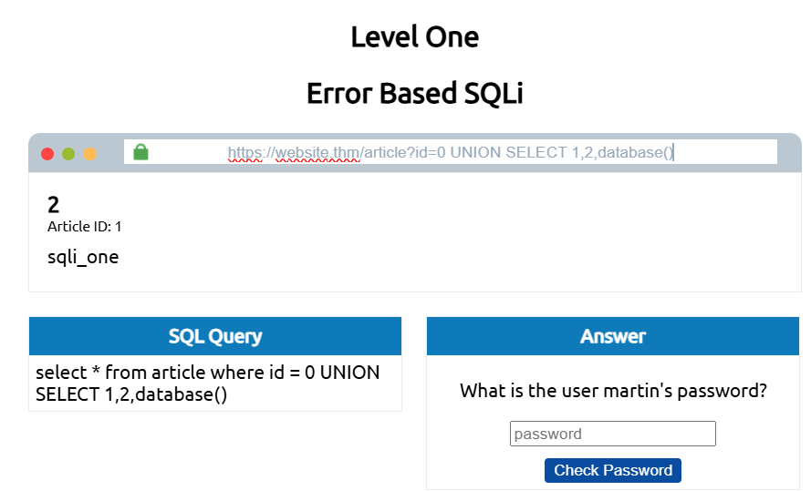
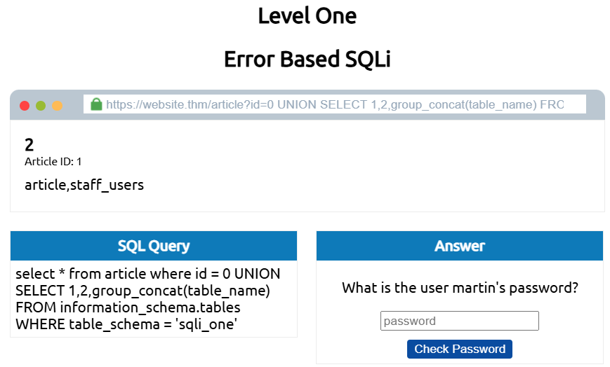
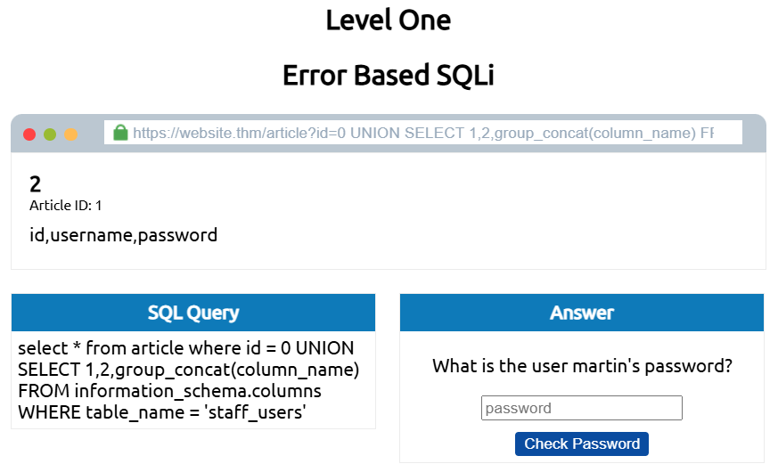
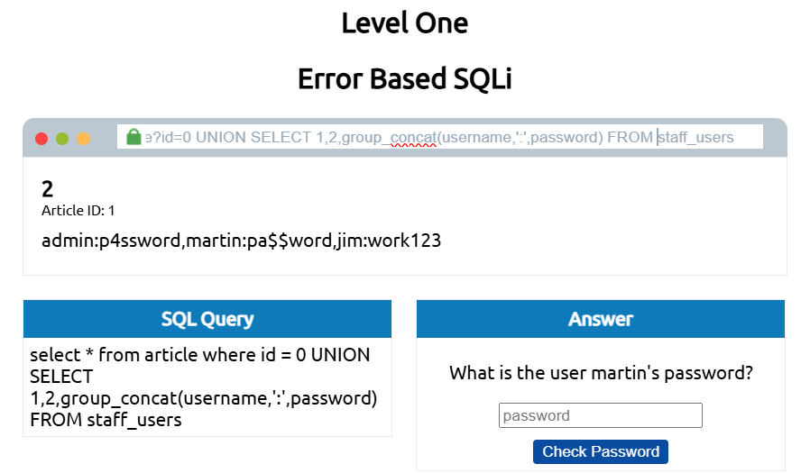
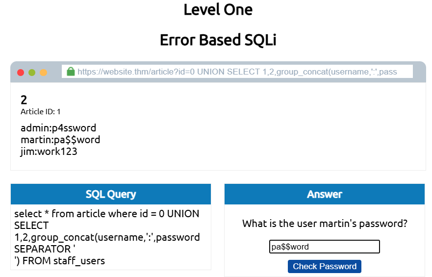

# SQL Injection

當應用程式將未經處理 (清洗與過濾) 的使用者輸入資料，直接拼接進 SQL 查詢指令中，導致惡意資料被資料庫視為指令的一部分執行時，就會發生 SQL 注入。

* [SQLi 長相](#sqli-長相)
* [In-Band](#in-band-sqli)
* [Blind](#blind-sqli-bsqli)
* [Out-of-Band](#out-of-band-sqli-oob-sqli)
* [Remediation](#remediation-補救預防措施)

### SQLi 長相

假設有一個部落格，每篇文章都有唯一的編號，文章可被設為公開或私人狀態，網址如：
`https://website.thm/blog?id=1`

上面網址可看出，所選的部落格文章是透過查詢字串中的 id 參數來取得，網路應用程式要從資料庫中取得該文章，會使用以下 SQL 查詢語句：
`SELECT * FROM blog WHERE id=1 AND private=0 LIMIT 1;`

private 值為 0 代表公開可讀。以上的語句即代表在 blog table 中尋找 id 為 1 且 private 為 0 的文章，並且限制結果只回傳 1 個匹配到的。以此例而言，id 參數是直接被用在 SQL 查詢語句中的。

假設編號 2 的文章處於私人狀態，那若將 URL 改成 `https://website.thm/blog?id=2;--`，那麼相當於 SQL 查詢語句為 `SELECT * FROM blog WHERE id=2;-- and private=0 LIMIT 1;`，又由於分號 `;` 表示語句結束且 `--` 或 `#` 後視為註釋，因此查詢的其實是 `SELECT * FROM blog WHERE id=2;`，如此即使文章編號 2 設為私人，這樣操作後變成能看到 id=2 的文章。

---

### In-Band SQLi

最容易被檢測和利用的 SQLi 類型。In-Band 指的是用同一個通訊管道 (同一個 HTTP 請求與回應) 去利用漏洞，發起攻擊並獲得結果，例如：在一個網頁上發現 SQL 注入漏洞，然後能夠從資料庫提取資料到同一網頁上。

> 也就是攻擊者在網頁的輸入框或 URL 注入惡意指令 (發送請求)，資料庫找到的機密資料會直接顯示在同一個網頁的回傳畫面上 (接收回應)。

##### Error-Based SQL Injection

因為資料庫的錯誤訊息會直接印在瀏覽器螢幕上，所以它是獲取關於資料庫結構的資訊最有效的方式。這種 SQLi 常被用於枚舉整個資料庫。

##### Union-Based SQL Injection

這種注入利用 SQL 中的 `UNION` 運算子搭配 `SELECT` 的語句，來回傳額外的結果到網頁上。這是透過 SQLi 漏洞來提取出大量資料最常見的方法。

##### THM 中的小實作練習


透過更改 ID 編號可以看不同文章。

Error-Based 的關鍵在於透過嘗試特定字元來破壞 SQL 查詢語句，直到產生錯誤訊息。最常見的字元有單引號與雙引號。

可以看到在 `id=1` 後面加上一個單引號後，回傳了語法錯誤訊息，這同時代表該網頁存在 SQL 注入漏洞。

嘗試使用 `UNION`：

錯誤訊息指出：`UNION SELECT` 語句與原始 `SELECT` 語句欄位數量不匹配，因此傳回錯誤。

新增欄位直到錯誤訊息消失：


現在出現了文章，但我們需要的是顯示出資料數據。會顯示文章是因為它從該網站程式碼的某處回傳第一個結果並顯示出來。要使得第一個查詢不回傳任何結果，我們可以將 ID 編號改為 0：

如此，這個回傳的結果就等同於只有 `UNION SELECT` 查詢的結果。接下來可以開始使用這些回傳的值來獲取有用的資訊。

獲取能夠存取的資料庫名稱：


獲取資料庫 `sqli_one` 中所有表的列表：

> `group_concat()` 函數用來將多個回傳的 row 當中指定的欄位 column (以此例而言為 `table_name`) 合併成一個以逗號 (`,`) 分隔的字串。

> 所有使用者皆可存取 `information_schema` 資料庫，而它包含有關使用者可存取的所有資料庫、所有表的資訊。

我們要找到 Martin 的密碼，因此我們要針對 `staff_users` 這個表。獲取表 `staff_users` 的結構：

> 要檢索的資訊從 `table_name` 換成了 `column_name`，要查詢的資料庫 `information_schema` 的 `table` 換成 `column`。

使用 `username` 與 `password` 這兩欄位來做查詢：

> 用冒號將帳號與密碼區分，提高可讀性。

除此之外，還可以添加 HTML 的 `<br>` 標籤，將原先的逗號分隔改為換行分隔，再度提高可讀性：


---

### Blind SQLi (BSQLi)

與 In-Band 不同，網頁在發生錯誤時並不會提供錯誤訊息，但攻擊者可以透過與資料庫互動，反覆盲測，網頁不會回傳任何資料庫的內容，攻擊者只能觀察網頁的狀態變化，來更進一步了解目標。

Authentication Bypass 繞過驗證：


##### Boolean Based

##### Time Based

---

### Out-of-Band SQLi (OOB SQLi)

攻擊者會使用兩種不同的溝通管道，一個用於攻擊，一個用於接收資料，收集結果。攻擊者會利用資料庫內建的功能，注入一段特殊的 SQL 指令，強迫資料庫伺服器向外部發起獨立的網路請求如 DNS 查詢或 HTTP 請求 (強迫資料庫存取一個由攻擊者控制的外部伺服器)，並將敏感資料夾帶在該請求中外洩。

```
DNS Exfiltration (DNS 外洩)：
防火牆通常會阻擋資料庫連上網頁 (HTTP Port 80 / HTTPS Port 443)，但幾乎不會阻擋 DNS 查詢 (Port 53)，因為伺服器需要解析網域，因此這是最常被利用的管道。

運作流程：
1. 攻擊者註冊一個網域 attacker.com，並控制該網域的 DNS 伺服器。

2. 對網頁注入惡意指令，嘗試存取 (SELECT password FROM users WHERE id=1).attacker.com 這個網路路徑。

3. 資料庫執行並串接，查到密碼是 admin123，因此網址被拼成 admin123.attacker.com。

4. 存取嘗試觸發了對該網域的 DNS 解析，因此向外發送 DNS 請求。

5. 該請求會被路由到攻擊者的 DNS 伺服器，攻擊者查看伺服器日誌，就能看到有人查詢 admin123.attacker.com，就能得知密碼為 admin123。
```

OOB SQLi 不常見，當 In-Band 與 Blind 技術皆無用時，攻擊者才會用 OOB。

優點：速度快，相較於 Blind 盲注，猜一個密碼可能需要發送數百次請求，而 OOB 只需一次，資料庫就會將密碼打包在 DNS 請求裡傳送到攻擊者連接的伺服器。

缺點：資料庫必須有外連權限，攻擊者才能成功建立通道、需要特殊的資料庫權限。

---

### Remediation 補救、預防措施

開發者有些方法可以保護它們的網路應用程式：
- Prepared Statements (With Parameterized Queries) 預處理語句、參數化查詢

    把 SQL 指令的架構先寫好，再把使用者輸入的資料作為參數填進語句中。這種方式可以確保 SQL 程式碼結構保持不變，資料庫也能夠區分查詢和數據。

    ```sql
    # 字串拼接 - 不安全
    SELECT * FROM users WHERE username = ' ' OR 1=1 --';

    # 參數化查詢 - 安全
    SELECT * FROM users WHERE username = ?;
    # 資料庫先編譯這行，將問號鎖定為純資料欄位，隨後填入參數
    ```
    即使攻擊者輸入 `' OR 1=1 --`，資料庫也只會尋找有沒有人的名字真的叫 `' OR 1=1 --`

- Input Validation 輸入驗證

    使用允許清單 (allow list) / 白名單 (white list) 可以將輸入限制為特定的字串，或是使用程式語言中字串替換方法來過濾允許或禁止的字串。輸入驗證檢查資料的格式與型態，過濾掉不合規則的請求。

    白名單驗證 (Whitelist Validation / Allow-list)：只允許符合特定規則的資料通過，其餘一律拒絕。例如使用者名稱只能包含字母或數字、年齡限制只能輸入 1 到 3 位數等。

- Escaping User Input 使用者輸入轉義

    一些特殊字元如 `'`、`"`、`$` 等能導致 SQL 語句改變，就能變成注入攻擊，使用者輸入轉義就是在這些字元前加上 `\` 來轉義，使它們解析為普通的字元。

    > 轉義並非萬能，它存在被繞過的風險。

- 採用最小權限原則 (Principle of Least Privilege，PoLP)

    透過降低 SQL 指令可以執行的動作，來降低 SQL 注入攻擊的風險。

- 不顯示錯誤訊息

    減少透露錯誤的原因，僅顯示 **請重新再試一次**，如此可以避免攻擊者蒐集情報。